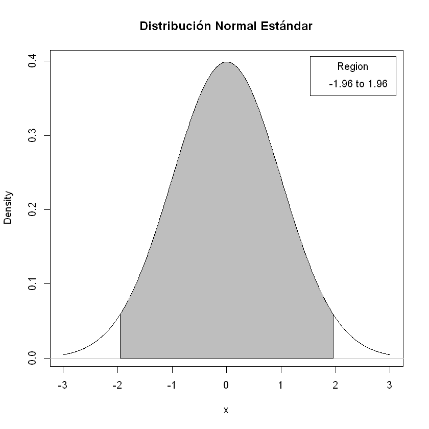
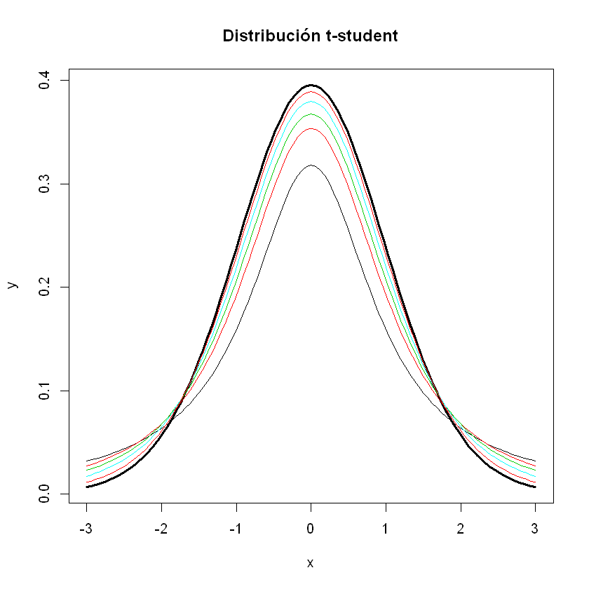
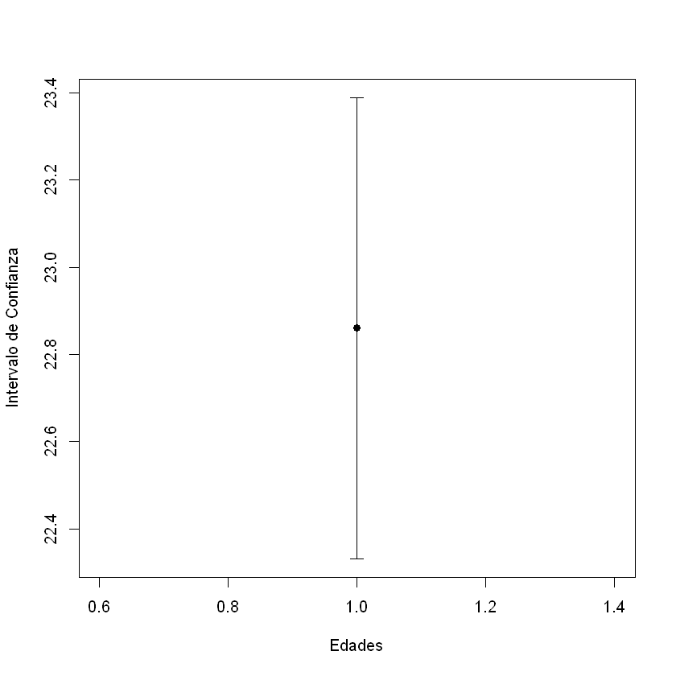

# INFERENCIA ESTADÍSTICA

Por lo general, contamos con recursos limitados (ya sea tiempo o dinero). Estas limitaciones no permiten que un censo se realice con frecuencia; por lo tanto, requerimos de trabajar con una muestra y calcular los parámetros poblacionales a partir de una muestra.

## Estimación de Parámetros. Estimadores

Los parámetros a estimar, básicamente, son dos: media y varianza.

Si la muestra es representativa, la media y la varianza poblacionales corresponderán a la media y varianza muestrales. Por lo que los valores encontrados corresponderán a una probabilidad.

La función de la media poblacional es:

<a href="https://www.codecogs.com/eqnedit.php?latex=\mu&space;=&space;\frac{\sum_{i=1}^{N}&space;X_{i}}{N}" target="_blank"></a>

y la muestral es:

<a href="https://www.codecogs.com/eqnedit.php?latex=\inline&space;\overline{x}&space;=&space;\frac{\sum_{i=1}^{n}&space;x_{i}}{n}" target="_blank"></a>

Básicamente, se calculan de la misma manera.

Cuando se calcula la varianza, sí se observa una diferencia sustancial:

Varianza Poblacional:

<a href="https://www.codecogs.com/eqnedit.php?latex=\inline&space;\sigma^{2}&space;=&space;\frac{\sum_{i=1}^{N}&space;\left(&space;X_{i}&space;-&space;\mu&space;\right)^{2}}{N}" target="_blank"></a>

Varianza Muestral

<a href="https://www.codecogs.com/eqnedit.php?latex=\inline&space;S^{2}&space;=&space;\frac{\sum_{i=1}^{n}&space;\left(&space;x_{i}&space;-&space;\overline{x}&space;\right)^{2}}{n-1}" target="_blank"></a>

### Ejemplo

Vamos a continuar con el ejemplo de las edades de los estudiantes. Como ya conocemos la población, vamos a usarlo como referencia para comprobar la precisión:


```R
load('Datos/estudiantes.RData')
edades<-poblacion[,c(2,5,15)]
head(edades)
```


<table>
<caption>A data.frame: 6 × 3</caption>
<thead>
	<tr><th scope=col>SEXO_BIOLOGICO</th><th scope=col>EDAD</th><th scope=col>FACULTAD</th></tr>
	<tr><th scope=col>&lt;fct&gt;</th><th scope=col>&lt;int&gt;</th><th scope=col>&lt;fct&gt;</th></tr>
</thead>
<tbody>
	<tr><td>HOMBRE</td><td>30</td><td>CIENCIAS</td></tr>
	<tr><td>HOMBRE</td><td>26</td><td>CIENCIAS</td></tr>
	<tr><td>HOMBRE</td><td>30</td><td>CIENCIAS</td></tr>
	<tr><td>HOMBRE</td><td>28</td><td>CIENCIAS</td></tr>
	<tr><td>MUJER </td><td>28</td><td>CIENCIAS</td></tr>
	<tr><td>MUJER </td><td>28</td><td>CIENCIAS</td></tr>
</tbody>
</table>


```R
library(samplingbook) # Para calcular el tamaño de la muestra
```

    Loading required package: pps
    Loading required package: sampling
    Loading required package: survey
    Loading required package: grid
    Loading required package: Matrix
    Loading required package: survival
    
    Attaching package: 'survival'
    
    The following objects are masked from 'package:sampling':
    
        cluster, strata
    
    
    Attaching package: 'survey'
    
    The following object is masked from 'package:graphics':
    
        dotchart
    
    


```R
tamaño<-sample.size.prop(e=0.05, P = 0.5, N = length(edades$EDAD), level = 0.95)$n # Vamos a usar P = 0.5
muestra<-sample(1:length(edades$EDAD), size = tamaño, replace = FALSE) # Diseñamos un M.A.S.
mas.edades<-edades[muestra,] # Tenemos la muestra
head(mas.edades)
```


<table>
<caption>A data.frame: 6 × 3</caption>
<thead>
	<tr><th></th><th scope=col>SEXO_BIOLOGICO</th><th scope=col>EDAD</th><th scope=col>FACULTAD</th></tr>
	<tr><th></th><th scope=col>&lt;fct&gt;</th><th scope=col>&lt;int&gt;</th><th scope=col>&lt;fct&gt;</th></tr>
</thead>
<tbody>
	<tr><th scope=row>18126</th><td>MUJER </td><td>18</td><td>C. HUMANAS </td></tr>
	<tr><th scope=row>12832</th><td>HOMBRE</td><td>22</td><td>F.QUÍMICAS </td></tr>
	<tr><th scope=row>16073</th><td>HOMBRE</td><td>19</td><td>F.MECÁNICAS</td></tr>
	<tr><th scope=row>9568</th><td>HOMBRE</td><td>19</td><td>F.QUÍMICAS </td></tr>
	<tr><th scope=row>17801</th><td>MUJER </td><td>18</td><td>C. HUMANAS </td></tr>
	<tr><th scope=row>20659</th><td>HOMBRE</td><td>20</td><td>F.QUÍMICAS </td></tr>
</tbody>
</table>


Ya lo hicimos en el módulo de muestreo, pero, vamos a calcular por separado los parámetros:


```R
# Media Poblacional
round(mean(edades$EDAD),1)
```


23


```R
# Media Muestral
round(mean(mas.edades$EDAD),1)
```


22.9


Ahora, calculemos la varianza. Tengamos en cuenta que estos parámetros no son equivalentes:

$$
\frac{\sum_{i=1}^{N} \left( X_{i} - \mu \right)^{2}}{N} \not\equiv \frac{\sum_{i=1}^{n} \left( x_{i} - \overline{x} \right)^{2}}{n-1}
$$

Debemos tener en cuenta que las funciones de los paquetes estadísticos, por defecto, calculan la varianza muestral; por lo tanto, debemos hacer la respectiva corrección $\left(N-1\right) / N$


```R
N<-length(edades$EDAD) # El tamaño de la población
round(var(edades$EDAD),3) # Varianza sin corrección
```


32.795


```R
round(var(edades$EDAD)*((N-1)/N),3) # Varianza Corregida
```


32.793


También podemos usar una función específica `popvar` de la librería `rafalib`:


```R
#install.packages('rafalib')
library(rafalib)
round(popvar(edades$EDAD),3)
```


32.793


Para la varianza muestral no requerimos ajustes:


```R
round(var(mas.edades$EDAD),3)
```


27.454


## Estimación por Máxima Verosimilitud

Consideremos los siguiente: $x_{1}, x_{2}, \dots, x_{n}$ corresponde a una m.a.s. de una población $X$ con una distribución de probabilidad $f(x|\theta)$ siendo $\theta$ un parámetro desconocido. Entonces, la función de verosimilitud se define como:

$$
L(\theta) = f \left(x_{1}, x_{2}, \dots, x_{n}|\theta\right)
$$

Como cada $x_{i}$ corresponde a una realización de la v.a. $X_{i}$ y sonm independientes e identicamente distribuidas (_idd_) la función de verosimilitud se escribe:

$$
L(\theta) = \prod_{i=1}^{n}f(x_{i}|\theta)
$$

La teoría nos indica que para encontrar el estimador máximo verosímil (_EMV_) para el parámetro poblacional desconocido $\theta$, debemos resolver el siguiente problema de maximización:

$$
\underset{\widehat{\theta}}{max} \; L(\theta) \text{ o bien } \underset{\widehat{\theta}}{max}\; ln\, L(\theta)
$$

Computacionalmente, el problema consiste en minimizar el negativo de la función de log-verisimilitud ya que $max\;Z = min\;(-Z)$ siendo $Z$ una función cualquiera. Entonces, se tiene:

$$
- ln\, L(\theta) = - ln \prod_{i=1}^{n} f\left( x_{i}|\theta\right) = - \sum_{i=1}^{n} ln\, f\left( x_{i}|\theta\right)
$$

## Ejemplo

Sigamos con el ejemplo de las edades y estimemos por _MV_ los parámetros.

Podemos usar dos funciones (no necesariamente ambas) `mle` y `mle2`. Cabe la posibildad que alguna librería no se encuentre actualizada

Primero, necesitamos instalar algunos paquetes:


```R
#install.packages("bbmle")
#install.packages("stats4")
library(stats4) # para la función mle
library(bbmle) # para la función mle2
```

Ahora construimos el negativo de la función de log-verosimilitud. Esta función, llamada `NegLogLik` en este caso, depende de los parámetros poblacionales desconocidos media y desviación estándar, $\mu$ y $\sigma$ respectivamente:


```R
x<-edades$EDAD # Para trabajar con los datos muestrales que requerimos
NegLogLik = function(mu,sigma){-sum(dnorm(x,mu,sigma,log = TRUE))}
```

Los parámetros muestrales para hacer las estimaciones


```R
m.mu<-mean(mas.edades$EDAD) # Media
m.sigma<-sd(mas.edades$EDAD) # Desviación Estándar
```

Construimos los estimadores. El argumento `star=list()` es para ingresar los valores iniciales con los cuales R construirá numéricamente una aproximación de la Matriz Hessiana asociada al problema de optimización


```R
EMV1 = mle(NegLogLik, start = list(mu=m.mu, sigma=m.sigma))
summary(EMV1) # Para visualizar los valores
```


    Maximum likelihood estimation
    
    Call:
    mle(minuslogl = NegLogLik, start = list(mu = m.mu, sigma = m.sigma))
    
    Coefficients:
           Estimate Std. Error
    mu    22.997172 0.03693371
    sigma  5.726511 0.02611588
    
    -2 log L: 152127.5 


```R
EMV2 = mle2(NegLogLik,start = list(mu=m.mu,sigma=m.sigma), data = list(x)) # La otra función
summary(EMV2)
```


    Maximum likelihood estimation
    
    Call:
    mle2(minuslogl = NegLogLik, start = list(mu = m.mu, sigma = m.sigma), 
        data = list(x))
    
    Coefficients:
           Estimate Std. Error z value     Pr(z)    
    mu    22.997172   0.036934  622.66 < 2.2e-16 ***
    sigma  5.726511   0.026116  219.27 < 2.2e-16 ***
    ---
    Signif. codes:  0 '***' 0.001 '**' 0.01 '*' 0.05 '.' 0.1 ' ' 1
    
    -2 log L: 152127.5 


## Intervalos de Confianza

El intervalo de confianza describe la variabilidad entre la medida obtenida en un estudio y la medida real de la población (el valor real). Corresponde a un rango de valores, cuya distribución es normal y en el cual se encuentra, con alta probabilidad, el valor real de una determinada variable.

Se trata de un par de números (o varios pares de números) dentro de los cuales se estima se encuentra un parámetro desconocido $\theta$.

Cuando la varianza $\sigma^{2}$ es conocida, el intervalo de confianza corresponde a:

$$
I.C \rightarrow \mu \in \overline{x} \pm Z_{(1-\alpha)} \frac{S_{x}}{\sqrt{n}}
$$

Donde

* $1-\alpha$ es el nivel de confianza deseado
* $Z_{1-\alpha}$ es el valor de la distribución normal estándar que corresponde al nivel de confianza deseado.
* $\frac{S_{x}}{\sqrt{n}}$ es el error estándar de la media

Los niveles de confianza más comunes son:

* 0.90 o 90% $\rightarrow Z = 1.64$
* 0.95 o 95% $\rightarrow Z = 1.96$
* 0.99 o 99% $\rightarrow Z = 2.57$


```R
# La gráfica de la distribución normal estándar
library(RcmdrMisc)
x <- seq(-3, 3, length.out=1000)  
plotDistr(x, dnorm(x, mean=0, sd=1), cdf=FALSE, xlab="x", ylab="Density", main=paste("Distribución Normal Estándar"), 
  regions=list(c(-1.96, 1.96)), col=c('#BEBEBE', '#BEBEBE'), legend.pos='topright')
```

    Loading required package: car
    Loading required package: carData
    Loading required package: sandwich
    Registered S3 methods overwritten by 'ggplot2':
      method         from 
      [.quosures     rlang
      c.quosures     rlang
      print.quosures rlang
    





Sigamos con el ejemplo de las edades de los estudiantes:


```R
# Primero los descriptivos básicos:
summary(mas.edades$EDAD)
```


       Min. 1st Qu.  Median    Mean 3rd Qu.    Max. 
      16.00   19.00   22.00   22.86   24.00   50.00 


```R
sd(mas.edades$EDAD)
```


5.23965051706779


Ahora, calculemos el intervalo:


```R
media <- mean(na.omit(mas.edades$EDAD)) # Pedimos la media
desv <- sd(na.omit(mas.edades$EDAD)) # La desviación estándar
N <- length(na.omit(mas.edades$EDAD)) # El tamaño válido de la muestra
error.est <- desv/sqrt(N) # Calculamos el error estándar
error <- 2*error.est # Fijamos Z=2 para indicar un nivel de confianza de 95%
lim.inf <- media-error # Límite inferior del intervalo
lim.sup <- media+error # Límite superior del intervalo
```


```R
# Guardamos todos los datos generados en un objeto data frame
resultado1 <- data.frame(media, desv, N, error.est, error, lim.inf, lim.sup)
resultado1
```


<table>
<caption>A data.frame: 1 × 7</caption>
<thead>
	<tr><th scope=col>media</th><th scope=col>desv</th><th scope=col>N</th><th scope=col>error.est</th><th scope=col>error</th><th scope=col>lim.inf</th><th scope=col>lim.sup</th></tr>
	<tr><th scope=col>&lt;dbl&gt;</th><th scope=col>&lt;dbl&gt;</th><th scope=col>&lt;int&gt;</th><th scope=col>&lt;dbl&gt;</th><th scope=col>&lt;dbl&gt;</th><th scope=col>&lt;dbl&gt;</th><th scope=col>&lt;dbl&gt;</th></tr>
</thead>
<tbody>
	<tr><td>22.86016</td><td>5.239651</td><td>379</td><td>0.2691428</td><td>0.5382855</td><td>22.32187</td><td>23.39844</td></tr>
</tbody>
</table>


Otra forma de estimar el intervalo de confianza es mediante la función `z.test` de la librería `TeachingDemos` que, a la vez, nos sirve para determinar si el valor de la media es el correcto:


```R
library(TeachingDemos) # Para usar la función z.test()
```


```R
z.test(mas.edades$EDAD, stdev = sd(mas.edades$EDAD), mu = mean(edades$EDAD))
```


    
    	One Sample z-test
    
    data:  mas.edades$EDAD
    z = -0.50907, n = 379.00000, Std. Dev. = 5.23965, Std. Dev. of the
    sample mean = 0.26914, p-value = 0.6107
    alternative hypothesis: true mean is not equal to 22.99717
    95 percent confidence interval:
     22.33265 23.38767
    sample estimates:
    mean of mas.edades$EDAD 
                   22.86016 
    


Un parámetro que, por lo general, se desconoce es la varianza. Cuando esto ocurre, no se emplea la disteibucion _Z_ sino la distribución _t-student_:

$$
I.C \rightarrow \mu \in \overline{x} \pm t \frac{S_{x}}{\sqrt{n}}
$$


```R
# La Gráfica de la distribución t-student:
curve(dt(x, df = 30), from = -3, to = 3, lwd = 3, ylab = "y", main = "Distribución t-student")
ind <- c(1, 2, 3, 5, 10)
for (i in ind) curve(dt(x, df = i), -3, 3, add = TRUE,col=i)
```





```R
media <- mean(na.omit(mas.edades$EDAD))
desv <- sd(na.omit(mas.edades$EDAD))
N <- length(na.omit(mas.edades$EDAD))
error.est <- desv/sqrt(N)
error <- qt(0.975, df= N-1) * error.est # Usar el cuantil 0.975 de t
lim.inf <- media-error
lim.sup <- media+error
```


```R
resultado2 <- data.frame(media, desv, N, error.est, error, lim.inf, lim.sup)
resultado2
```


<table>
<caption>A data.frame: 1 × 7</caption>
<thead>
	<tr><th scope=col>media</th><th scope=col>desv</th><th scope=col>N</th><th scope=col>error.est</th><th scope=col>error</th><th scope=col>lim.inf</th><th scope=col>lim.sup</th></tr>
	<tr><th scope=col>&lt;dbl&gt;</th><th scope=col>&lt;dbl&gt;</th><th scope=col>&lt;int&gt;</th><th scope=col>&lt;dbl&gt;</th><th scope=col>&lt;dbl&gt;</th><th scope=col>&lt;dbl&gt;</th><th scope=col>&lt;dbl&gt;</th></tr>
</thead>
<tbody>
	<tr><td>22.86016</td><td>5.239651</td><td>379</td><td>0.2691428</td><td>0.5292046</td><td>22.33095</td><td>23.38936</td></tr>
</tbody>
</table>


O usando la función `t.test`:


```R
t.test(mas.edades$EDAD, mu = mean(edades$EDAD))
```


    
    	One Sample t-test
    
    data:  mas.edades$EDAD
    t = -0.50907, df = 378, p-value = 0.611
    alternative hypothesis: true mean is not equal to 22.99717
    95 percent confidence interval:
     22.33095 23.38936
    sample estimates:
    mean of x 
     22.86016 
    


Cuando se trata de proporciones, el intervalo de confianza se estima mediante:

$$
I.C. \rightarrow \pi \in p \pm Z \sqrt{\frac{p (1 - p)}{n}}
$$


```R
library(descr)
freq(mas.edades$SEXO_BIOLOGICO, plot = FALSE)
```


<table>
<caption>A S3: freqtable: 3 × 2 of type S3: freqtable</caption>
<thead>
	<tr><th></th><th scope=col>Frequency</th><th scope=col>Percent</th></tr>
</thead>
<tbody>
	<tr><th scope=row>HOMBRE</th><td>220</td><td> 58.04749</td></tr>
	<tr><th scope=row>MUJER</th><td>159</td><td> 41.95251</td></tr>
	<tr><th scope=row>Total</th><td>379</td><td>100.00000</td></tr>
</tbody>
</table>


Preparamos los datos para el cálculo del intervalo de confianza, en este caso vamos a seleccionar una categoría: `HOMBRE` en la distribución de `SEXO_BIOLOGICO`:


```R
cat <- ifelse(mas.edades$SEXO_BIOLOGICO=="HOMBRE", 1, 0)
prop.table(table(cat))
```


    cat
            0         1 
    0.4195251 0.5804749 


```R
p <- mean(cat)
p # Esta es la proporción de estudiantes hombres
```


0.580474934036939


```R
n <- length(cat) # Tamaño de la muestra 
error.est.p <- sqrt((p*(1-p))/n) # Error estándar de la propoción
error.p <- 2 * error.est.p # Usamos Z = 2 para indicar un nivel de confianza del 95%
lim.inf.p <- p - error.p 
lim.sup.p <- p + error.p
```


```R
result.p <- data.frame(p, n, error.est.p, error.p, lim.inf.p, lim.sup.p)
result.p
```


<table>
<caption>A data.frame: 1 × 6</caption>
<thead>
	<tr><th scope=col>p</th><th scope=col>n</th><th scope=col>error.est.p</th><th scope=col>error.p</th><th scope=col>lim.inf.p</th><th scope=col>lim.sup.p</th></tr>
	<tr><th scope=col>&lt;dbl&gt;</th><th scope=col>&lt;int&gt;</th><th scope=col>&lt;dbl&gt;</th><th scope=col>&lt;dbl&gt;</th><th scope=col>&lt;dbl&gt;</th><th scope=col>&lt;dbl&gt;</th></tr>
</thead>
<tbody>
	<tr><td>0.5804749</td><td>379</td><td>0.02534843</td><td>0.05069686</td><td>0.5297781</td><td>0.6311718</td></tr>
</tbody>
</table>


O usando la función `binconf` de la librería `Hmisc`:


```R
library(Hmisc)
binconf(x = 218, n = 379)
```

    Loading required package: lattice
    Loading required package: Formula
    Loading required package: ggplot2
    
    Attaching package: 'Hmisc'
    
    The following objects are masked from 'package:TeachingDemos':
    
        cnvrt.coords, subplot
    
    The following object is masked from 'package:RcmdrMisc':
    
        Dotplot
    
    The following object is masked from 'package:survey':
    
        deff
    
    The following objects are masked from 'package:base':
    
        format.pval, units
    
    


<table>
<caption>A matrix: 1 × 3 of type dbl</caption>
<thead>
	<tr><th scope=col>PointEst</th><th scope=col>Lower</th><th scope=col>Upper</th></tr>
</thead>
<tbody>
	<tr><td>0.5751979</td><td>0.5249222</td><td>0.6239645</td></tr>
</tbody>
</table>


Gráficamente, ¿cómo lo podemos representar? Una opción es las gráficas de error


```R
library(plotrix)
plotCI(mean(mas.edades$EDAD), ui = lim.sup, li = lim.inf, xlab = 'Edades', ylab = 'Intervalo de Confianza', pch = 19)
```




